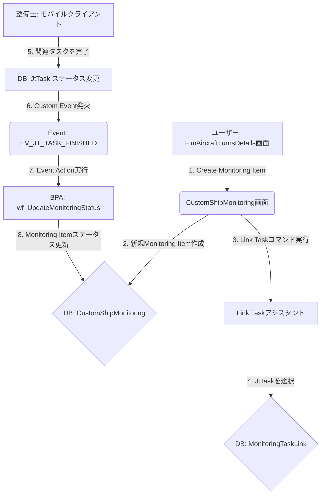

# Ship Monitoring 機能 Configuration設計書

## 1. ドキュメント管理・概要

- **ドキュメントID / タイトル**: `SPEC-CFG-FLMEXE-ShipMonitoring-001` / Ship Monitoring 機能 Configuration設計書
- **対象IFSバージョン**: IFS Cloud 25R2
- **対象モジュール / 画面名 (Component / Page)**: `FLMEXE` / `CustomShipMonitoring.client`, `FlmAircraftTurnsDetails.client`
- **関連LU (Logical Unit) / Projection**: `CustomShipMonitoring`, `CustomTurnNote`, `MonitoringTaskLink`, `JtTask`
- **目的・業務背景**: 整備記録には残せないが、注意が必要な事象（不具合の予兆など）を追跡・管理し、関連する整備タスクの完了をもって自動でクローズするための仕組みを構築する。
- **採用するConfiguration機能一覧**: Custom Entities, Custom Pages, Page Configuration, Custom Events, Event Actions, BPA Workflow

## 2. ソリューション全体構造 & 連携シーケンス

## 5. ビジネスプロセス・自動化 (BPA / Workflow) 仕様

- **Workflow ID / Process Definition Key**: `wf_UpdateMonitoringStatus`
- **トリガー条件**: `Event Invoked` (Custom Event `EV_JT_TASK_FINISHED` により起動)
- **インプットパラメータ**:
  - `task_objkey`: `JtTask`のObjkey
- **プロセスフロー設計**:
  1. **Start**: ワークフロー開始
  2. **Script Task (Get Monitoring ID)**: `task_objkey`を基に`MonitoringTaskLink`テーブルを検索し、対応する`MonitoringId`を取得する。
  3. **Exclusive Gateway (Monitoring ID Found?)**: `MonitoringId`が見つかったかどうかで分岐。
  4. **Service Task (Update Status)**: `MonitoringId`をキーに`CustomShipMonitoring_API.Set_Status_('IN_PROGRESS', ...)`を呼び出し、ステータスを更新する。
  5. **End**: ワークフロー終了
- **実行するサービス・Projection Call**:
  - **Get Monitoring ID**: `Monitoring_Task_Link_API.Get_Monitoring_Id_By_Task(:task_objkey)`
  - **Update Status**: `Custom_Ship_Monitoring_API.Set_Status_`

## 6. イベント & トリガー (Custom Events & Event Actions) 仕様

- **Event ID**: `EV_JT_TASK_FINISHED`
- **対象LU**: `JtTask`
- **Event Type**: `Model Event` (標準LUのイベント)
- **トリガータイミング**: `After / On Commit - Update`
- **発火条件 (Event Condition 式)**:
  - `(NEW:Objstate = 'Finished') AND (OLD:Objstate != 'Finished')`
- **Event Actions 詳細**:
  - **Action Type**: `Execute Workflow`
  - **実行パラメータ**:
    - **Workflow ID**: `wf_UpdateMonitoringStatus`
    - **Input Parameters**:
      - `task_objkey` = `:NEW:Objkey`

---

*その他のセクションは、実装の進捗に合わせて追記する。*
