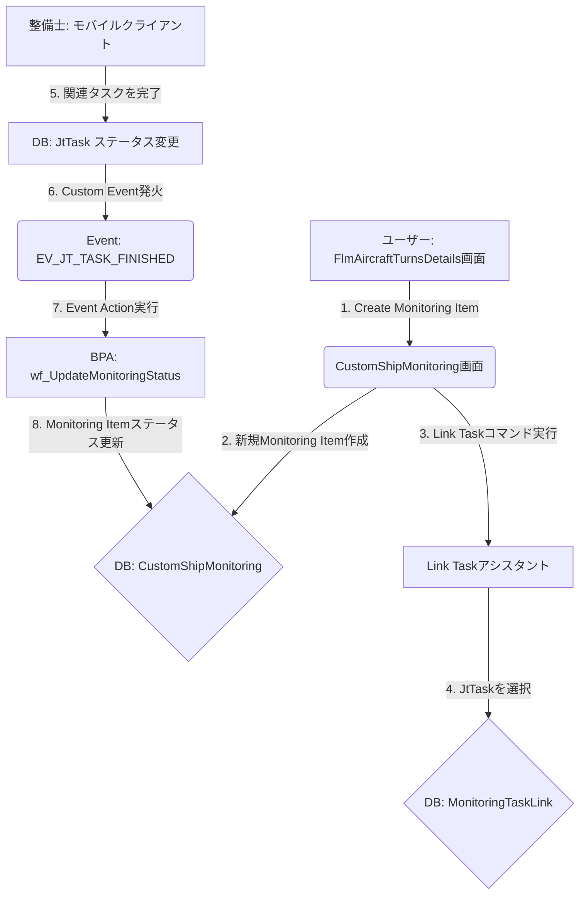

# Ship Monitoring 機能 Configuration設計書

## 1. ドキュメント管理・概要

- **ドキュメントID / タイトル**: `SPEC-CFG-FLMEXE-ShipMonitoring-001` / Ship Monitoring 機能 Configuration設計書
- **対象IFSバージョン**: IFS Cloud 25R2
- **対象モジュール / 画面名 (Component / Page)**: `FLMEXE` / `CustomShipMonitoring.client`, `FlmAircraftTurnsDetails.client`
- **関連LU (Logical Unit) / Projection**: `CustomShipMonitoring`, `CustomTurnNote`, `MonitoringTaskLink`, `JtTask`
- **目的・業務背景**: 整備記録には残せないが、注意が必要な事象（不具合の予兆など）を追跡・管理し、関連する整備タスクの完了をもって自動でクローズするための仕組みを構築する。
- **採用するConfiguration機能一覧**: Custom Entities, Custom Pages, Page Configuration, Custom Events, Event Actions, BPA Workflow

## 2. ソリューション全体構造 & 連携シーケンス

## 5. ビジネスプロセス・自動化 (BPA / Workflow) 仕様

- **Workflow ID / Process Definition Key**: `wf_UpdateMonitoringStatus`
- **トリガー条件**: `Event Invoked` (Custom Event `EV_JT_TASK_FINISHED` により起動)
- **インプットパラメータ**:
  - `task_objkey`: `JtTask`のObjkey
- **プロセスフロー設計**:
  1. **Start**: ワークフロー開始
  2. **Script Task (Get Monitoring ID)**: `task_objkey`を基に`MonitoringTaskLink`テーブルを検索し、対応する`MonitoringId`を取得する。
  3. **Exclusive Gateway (Monitoring ID Found?)**: `MonitoringId`が見つかったかどうかで分岐。
  4. **Service Task (Update Status)**: `MonitoringId`をキーに`CustomShipMonitoring_API.Set_Status_('IN_PROGRESS', ...)`を呼び出し、ステータスを更新する。
  5. **End**: ワークフロー終了
- **実行するサービス・Projection Call**:
  - **Get Monitoring ID**: `Monitoring_Task_Link_API.Get_Monitoring_Id_By_Task(:task_objkey)`
  - **Update Status**: `Custom_Ship_Monitoring_API.Set_Status_`

## 6. イベント & トリガー (Custom Events & Event Actions) 仕様

- **Event ID**: `EV_JT_TASK_FINISHED`
- **対象LU**: `JtTask`
- **Event Type**: `Model Event` (標準LUのイベント)
- **トリガータイミング**: `After / On Commit - Update`
- **発火条件 (Event Condition 式)**:
  - `(NEW:Objstate = 'Finished') AND (OLD:Objstate != 'Finished')`
- **Event Actions 詳細**:
  - **Action Type**: `Execute Workflow`
  - **実行パラメータ**:
    - **Workflow ID**: `wf_UpdateMonitoringStatus`
    - **Input Parameters**:
      - `task_objkey` = `:NEW:Objkey`

---

*その他のセクションは、実装の進捗に合わせて追記する。*

## 7. セキュリティ & 権限 (Permission Sets)

- **必要なProjection権限 Grant/Revoke**:
  - `CustomShipMonitoringHandling`: Full Grant
  - 下記ロールに対して、本Projectionへの全てのAction権限を付与する。
- **対象Permission Set / ロール**:
  - `FLM_TECHNICIAN`
  - `FLM_SUPERVISOR`
- **Custom Page / Quick Report へのアクセス制御**:
  - `CustomShipMonitoring.client` ページへのナビゲーション権限を上記ロールに付与する。

## 9. テストケース & 単体検証シナリオ

- **検証環境前提**:
  - `FLM_TECHNICIAN` 権限を持つテストユーザーが存在すること。
  - `AircraftTurn` および `JtTask` のテストデータが存在すること。
- **テストマトリクス**:

| No | シナリオ種別 | 前提条件 | 実施手順 | 期待される結果 (UI / DB / イベントログ) |
| --- | --- | --- | --- | --- |
| 1 | 正常系 (Turn Note作成) | `FlmAircraftTurnsDetails`画面を開いている | 1. "Turn Notes"タブを開く。   2. 新規レコードを作成し、ノートを記入して保存する。 | 1. UI上でノートがリストに表示される。   2. `CUSTOM_TURN_NOTE_TAB`テーブルにレコードが作成されている。 |
| 2 | 正常系 (Monitoring Item作成) | `FlmAircraftTurnsDetails`画面を開いている | 1. "Create Monitoring Item"コマンドを実行する。   2. `CustomShipMonitoring`画面に遷移することを確認する。   3. 各項目を入力して保存する。 | 1. `CUSTOM_SHIP_MONITORING_TAB`テーブルにレコードが作成されている。 |
| 3 | 正常系 (Taskリンク) | No.2で作成したMonitoring Itemを`CustomShipMonitoring`画面で開いている | 1. "Link Task"コマンドを実行する。   2. アシスタントが表示され、タスク一覧が表示される。   3. タスクを1つ選択し、"Finish"をクリックする。 | 1. UI上の"Linked Tasks"リストに選択したタスクが表示される。   2. `MONITORING_TASK_LINK_TAB`テーブルにレコードが作成されている。 |
| 4 | 正常系 (BPA連携) | No.3で紐づけられたTaskが`JtTask`画面で開かれている | 1. タスクのステータスを`Finished`に変更して保存する。 | 1. `Custom_Events`ログに`EV_JT_TASK_FINISHED`が記録される。   2. `BPA`の実行ログが確認できる。   3. `CustomShipMonitoring`の該当レコードのステータスが`IN_PROGRESS`に更新されている。 |
| 5 | 権限制御 | `FLM_TECHNICIAN`以外の権限でログイン | 1. `FlmWorkManagement`のナビゲーターを確認する。 | 1. "Ship Monitoring"メニューが表示されないことを確認する。 |
