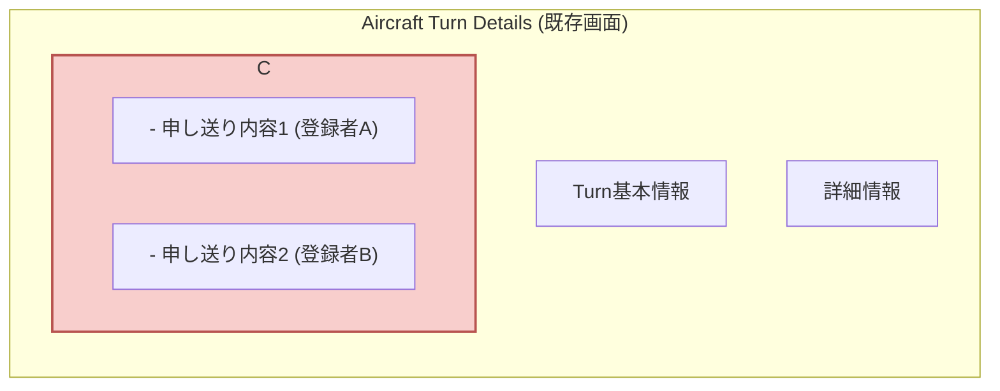
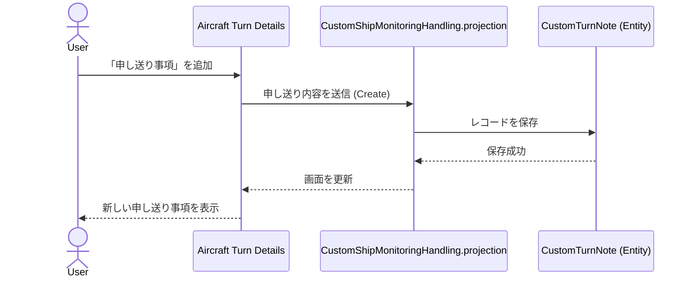
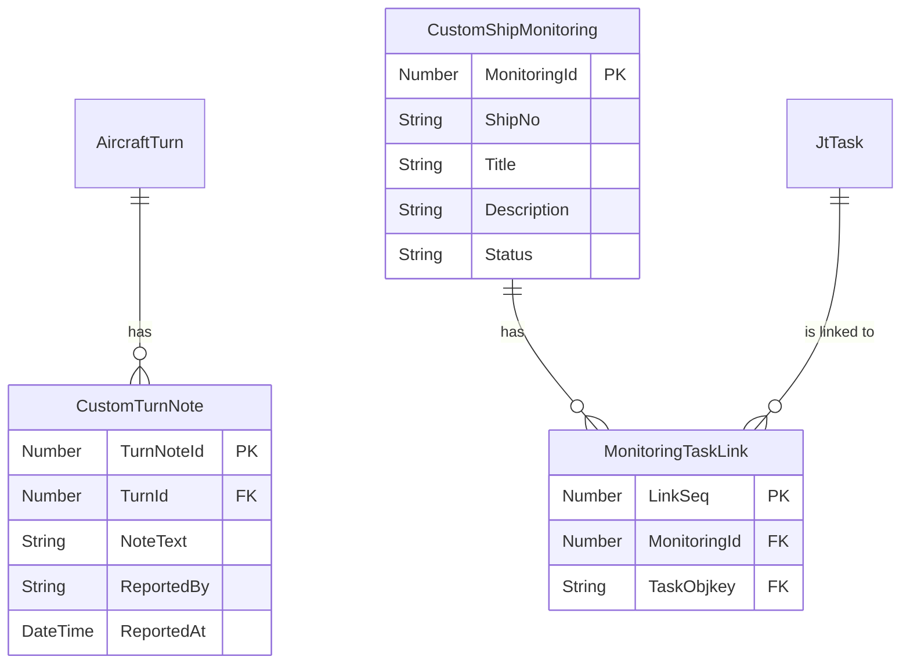

# イメージ：Shared Info 後継機能 完成予想図

このドキュメントは、「手順書」に基づいてIFS Cloud上に構築される「Shared Info 後継機能」が、最終的にどのようなシステムとして完成するのかを、Mermaid図を多用して視覚的に分かりやすく解説するものです。

## 1. 全体像：IFS Cloudに統合される2つの新機能

完成するシステムは、大きく分けて「**申し送り事項管理**」と「**注視事象管理**」の2つの機能で構成されます。これらはIFS Cloudの既存画面への統合と、全く新しいカスタム画面として実現されます。

```mermaid
graph TD
    subgraph IFS Cloud Aurena UI
        A["既存画面: Aircraft Turn Details"] -- 統合 --> B(機能1: 申し送り事項リスト)
        C["新規画面: Ship Monitoring"] -- 実装 --> D(機能2: 注視事象管理)
    end

    subgraph IFS Cloud Backend (Configuration)
        B --talks to-- E{CustomTurnNote Entity}
        D --talks to-- F{CustomShipMonitoring Entity}
        D --talks to-- G{MonitoringTaskLink Entity}
        H[BPA Workflow] --automates-- F
    end

    style A fill:#dae8fc,stroke:#6c8ebf,stroke-width:2px
    style C fill:#d5e8d4,stroke:#82b366,stroke-width:2px
```

---

## 2. 機能1: 申し送り事項 (Turn Note) 管理

`Aircraft Turn Details` 画面内に、関連する「申し送り事項」を直接記録・確認できる機能が追加されます。

### 画面イメージ

既存画面の下部に、新たに「申し送り事項 (Turn Notes)」セクションが追加され、一覧形式で申し送り内容が表示されます。



### 処理の流れ

ユーザーが申し送り事項を追加すると、そのデータはバックエンドのカスタムエンティティ（専用テーブル）に保存されます。



---

## 3. 機能2: 注視事象 (Ship Monitoring) 管理

機体ごとの予防整備や、長期間にわたる経過観察が必要な事象を管理するための、独立した「Ship Monitoring」ページが新設されます。

### 画面イメージ

メイン画面では注視事象が一覧表示され、各項目を選択すると詳細情報や関連付けられた整備タスクが確認できます。

```mermaid
graph TD
    subgraph "Ship Monitoring (新規カスタム画面)"
        A[一覧エリア] --> B{詳細エリア}
        subgraph A
            direction LR
            C[Filter (機番, 状態)]
            D[注視事象リスト<br>- ID: 001, Title: XXX, Status: OPEN<br>- ID: 002, Title: YYY, Status: IN_PROGRESS]
        end
        subgraph B
            direction TB
            E[基本情報<br>- Title, Description, Status...]
            F[タブ]
            subgraph F
                G["<b>関連タスク</b>"]
                H["その他情報"]
            end
            I[関連タスクリスト<br>- Task ID: 123, Status: Finished<br>- Task ID: 456, Status: Released]
        end
    end
    style G fill:#f8cecc,stroke:#b85450,stroke-width:2px
```

### ビジネスプロセスの自動化 (BPA Workflow)

この機能の最大の特徴は、**関連タスクの完了をトリガーとしたステータスの自動更新**です。これにより、手動でのステータス変更漏れを防ぎます。

```mermaid
flowchart TD
    A(整備士が関連タスクを完了) --> B{JtTask.Objstate = 'Finished'};
    B --> C{Custom Event発火<br>(EV_JT_TASK_COMPLETED)};
    C --> D[BPA Workflow起動<br>(wf_UpdateMonitoringStatus)];
    D --> E{関連を検索<br>MonitoringTaskLink};
    E --> F{CustomShipMonitoringHandling.projection<br>経由でステータスを更新};
    F --> G[Ship Monitoring画面の<br>ステータスが自動で<br>'IN_PROGRESS'に変わる];

    style C fill:#d5e8d4,stroke:#82b366,stroke-width:2px
    style D fill:#d5e8d4,stroke:#82b366,stroke-width:2px
```

---

## 4. データモデル全体像 (Entity Relationship Diagram)

このシステムは、3つの新しいカスタムエンティティ（テーブル）と、IFSの既存エンティティを連携させて動作します。



## 5. まとめ

以上の通り、「手順書」に沿って実装を進めることで、IFS Cloudの標準機能のみを活用し、保守性と拡張性に優れた「申し送り事項」および「注視事象」管理システムが完成します。ユーザーの操作は簡素化され、バックグラウンドではプロセスが自動化されることで、業務効率の大幅な向上が期待できます。
